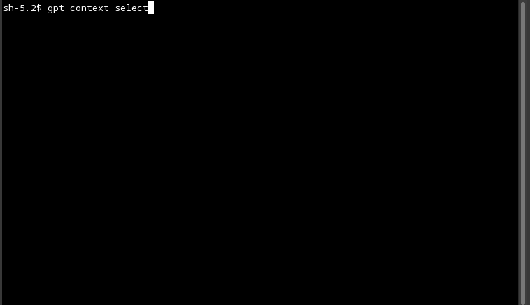

# CLI GPT - Basic CLI Interface to OpenAI Model Services

`CLI GPT` is a simple command line application build around [go-openai](https://github.com/sashabaranov/go-openai) offering a [ChatGPT](https://openai.com/blog/chatgpt) like experience.

# Installation

Install the application

```shell
go install github.com/alwitt/cli-gpt@latest
```

Create a user friendly alias

```shell
alias gpt="cli-gpt"
```

# Getting Started

First, create a new user entry.

```shell
gpt create user
```


Start a new chat session. Select `turbo` to use the model [ChatGPT](https://openai.com/blog/chatgpt) is based on. For more information regarding the request parameters, see [OpenAI API documentation](https://platform.openai.com/docs/api-reference/chat/create).

```shell
gpt create chat
```


To append to the currently active chat session (the active chat session has `in-focus` set to true)

```shell
gpt chat
```


To change the currently active chat session

```shell
gpt context select-chat
```



To view the complete history of a chat session

```shell
gpt describe chat
```


## Multi-user Support

The application associates chats with a user, and supports multiple users. However, only one user can be active at any point in time.

To change the currently active user

```shell
gpt context select-user
```


# Local Development

First verify all unit-tests are passing.

```shell
go test ./...
```

Then build the application.

```shell
go build -o gpt .
```
